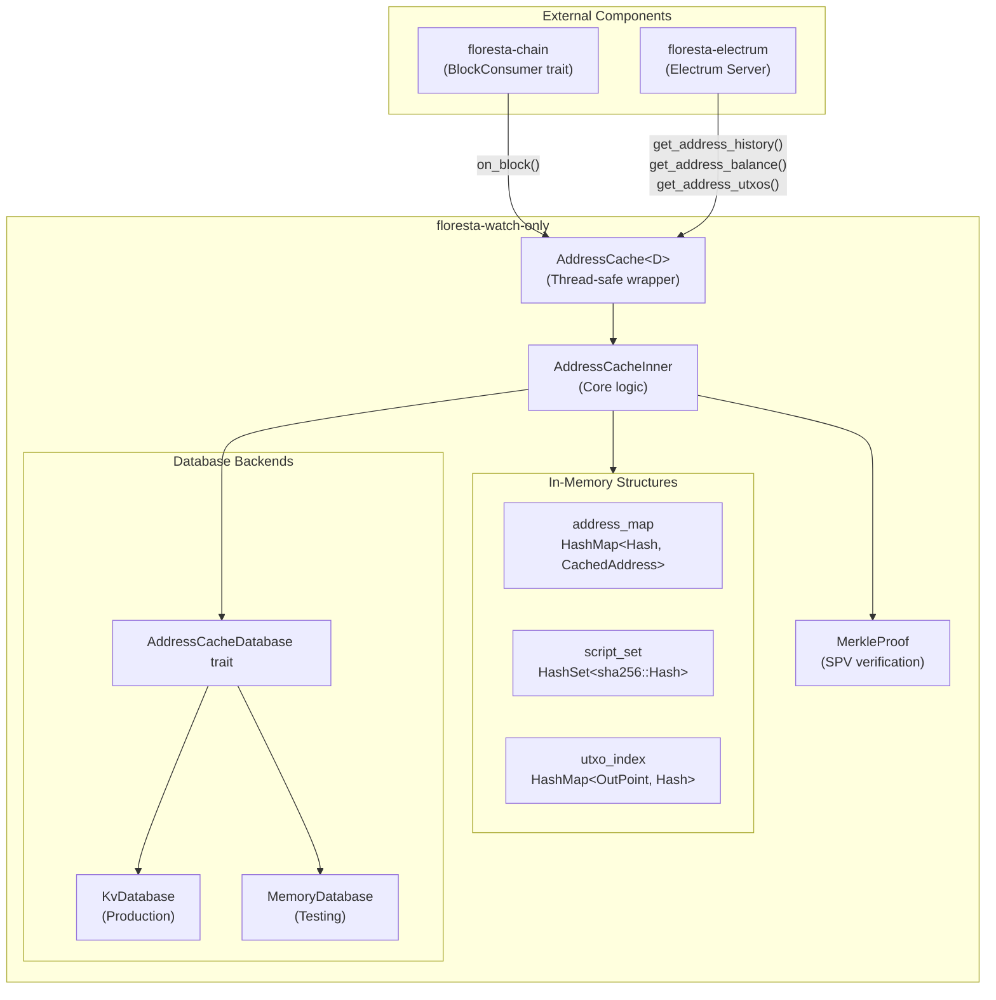
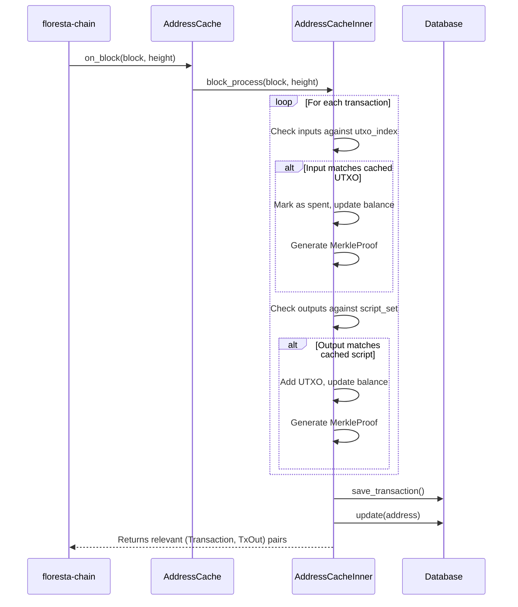

# floresta-watch-only

`floresta-watch-only` is a lightweight, Electrum-first watch-only wallet for the Floresta project. It tracks Bitcoin addresses using public descriptors, processes blocks in real-time for transaction detection, manages UTXOs with spent-output tracking, and generates Merkle proofs for SPV verification. It supports HD wallets through descriptor-based address derivation, implements the `BlockConsumer` trait to receive block notifications from `floresta-chain`, and provides persistent storage with pluggable database backends.

This crate powers `florestad`'s RPC and `floresta-electrum` with address history, balance query and UTXO lookups.

## Why Use a Watch-Only Wallet

Watch-only wallets track Bitcoin addresses and transactions using only public descriptors and derived addresses. Since no secret keys are stored or handled, a compromised watch-only wallet cannot spend funds — it can only reveal which addresses belong to the wallet and their transaction history. This security tradeoff makes it safe to run on internet-facing servers, where the risk of compromise is higher, while keeping signing capabilities entirely separate.

### Electrum Server Infrastructure

Serve Electrum protocol clients by caching addresses, transactions, and UTXOs that belong to the user's wallets. Only data related to watched wallets is stored, not the entire blockchain index.

### Blockchain Monitoring Services

Build transaction monitoring, notification services, and accounting systems that track Bitcoin activity using public descriptors for read-only access to blockchain data.

### Read-Only Wallet Backends

Provide balance, transaction history, and UTXO data to wallet interfaces while keeping signing operations separate, whether for individual users, payment processors, or exchanges.

## Architecture

The crate is organized around a central `AddressCache<D>` struct that wraps an inner cache with `RwLock` for thread-safe access. The cache maintains three primary data structures: an address map (script hash to `CachedAddress`), a script set for fast lookup, and a UTXO index for tracking spendable outputs.



## Key Components

### CachedTransaction

Stores transaction data along with metadata required for Electrum protocol responses:

| Field | Type | Description |
|-------|------|-------------|
| `tx` | `Transaction` | The full Bitcoin transaction |
| `height` | `u32` | Block height (0 for unconfirmed) |
| `merkle_block` | `Option<MerkleProof>` | SPV proof for confirmed transactions |
| `hash` | `Txid` | Transaction identifier |
| `position` | `u32` | Position in block for Merkle proof |

### CachedAddress

Tracks per-address state including balance and transaction history:

| Field | Type | Description |
|-------|------|-------------|
| `script_hash` | `sha256::Hash` | Electrum-style script hash |
| `balance` | `u64` | Current confirmed balance in satoshis |
| `script` | `ScriptBuf` | The output script |
| `transactions` | `Vec<Txid>` | Associated transaction IDs |
| `utxos` | `Vec<OutPoint>` | Unspent transaction outputs |

### AddressCacheDatabase Trait

A generic interface for database backends, enabling different storage implementations:

```rust,no_run
# use core::fmt;
# use bitcoin::hash_types::Txid;
# use floresta_watch_only::{CachedTransaction, CachedAddress, Stats};
pub trait AddressCacheDatabase {
    type Error: fmt::Debug + Send + Sync + 'static;

    fn save(&self, address: &CachedAddress);
    fn load(&self) -> Result<Vec<CachedAddress>, Self::Error>;
    fn update(&self, address: &CachedAddress);
    fn get_cache_height(&self) -> Result<u32, Self::Error>;
    fn set_cache_height(&self, height: u32) -> Result<(), Self::Error>;
    fn desc_save(&self, descriptor: &str) -> Result<(), Self::Error>;
    fn descs_get(&self) -> Result<Vec<String>, Self::Error>;
    fn get_transaction(&self, txid: &Txid) -> Result<CachedTransaction, Self::Error>;
    fn save_transaction(&self, tx: &CachedTransaction) -> Result<(), Self::Error>;
    fn list_transactions(&self) -> Result<Vec<Txid>, Self::Error>;
    fn get_stats(&self) -> Result<Stats, Self::Error>;
    fn save_stats(&self, stats: &Stats) -> Result<(), Self::Error>;
}
```

### MerkleProof

Generates and verifies SPV proofs for transactions within blocks. Proofs are created during block processing and can be verified against a block's Merkle root.

## Usage

### Basic Setup with KvDatabase

```rust,no_run
# use floresta_watch_only::WatchOnlyError;
# use floresta_watch_only::kv_database::KvDatabaseError;
# fn main() -> Result<(), WatchOnlyError<KvDatabaseError>> {
use floresta_watch_only::{AddressCache, kv_database::KvDatabase};

// Create a persistent database
let database = KvDatabase::new("./data/wallet".to_string())?;

// Initialize the address cache
let cache = AddressCache::new(database);
cache.setup()?;

// Add a descriptor for HD wallet derivation
let descriptor = "wpkh([fingerprint/84h/0h/0h]xpub.../0/*)";
cache.push_descriptor(descriptor)?;
cache.derive_addresses()?;
# Ok(())
# }
```

### Tracking Individual Addresses

```rust,no_run
# use floresta_watch_only::{AddressCache, kv_database::KvDatabase};
use bitcoin::ScriptBuf;
use floresta_common::get_spk_hash;

# fn main() {
# let database = KvDatabase::new("/tmp/floresta-doctest".to_string()).unwrap();
# let cache = AddressCache::new(database);
// Cache a specific address
let script = ScriptBuf::from_hex("00142b6a2924aa9b1b115d1ac3098b0ba0e6ed510f2a").unwrap();
cache.cache_address(script.clone());

// Query address data using the Electrum-style script hash
let script_hash = get_spk_hash(&script);
let balance = cache.get_address_balance(&script_hash);
let history = cache.get_address_history(&script_hash);
let utxos = cache.get_address_utxos(&script_hash);
# }
```

### Integration with BlockConsumer

The `AddressCache` implements `BlockConsumer` from `floresta-chain`, allowing it to receive block notifications:

```rust,no_run
# use floresta_watch_only::{AddressCache, kv_database::KvDatabase};
use floresta_chain::BlockConsumer;

# fn main() {
# let database = KvDatabase::new("/tmp/floresta-doctest".to_string()).unwrap();
# let cache = AddressCache::new(database);
// AddressCache<D> implements BlockConsumer, so when connected
// to floresta-chain, on_block() is called for each new block,
// processing it and detecting relevant transactions.
assert!(!cache.wants_spent_utxos());
# }
```

### Retrieving Merkle Proofs

```rust,no_run
# use floresta_watch_only::{AddressCache, kv_database::KvDatabase};
# use bitcoin::hash_types::Txid;
# use bitcoin::hashes::Hash as HashTrait;
# fn main() -> Result<(), String> {
# let database = KvDatabase::new("/tmp/floresta-doctest".to_string()).unwrap();
# let cache = AddressCache::new(database);
# let txid = Txid::all_zeros();
# let merkle_root = bitcoin::hashes::sha256d::Hash::all_zeros();
// Get SPV proof for a confirmed transaction
if let Some(proof) = cache.get_merkle_proof(&txid) {
    // Verify against a known Merkle root
    let is_valid = proof.verify(merkle_root)?;

    // Export proof data
    let hashes = proof.to_string_array();
    let position = proof.pos;
}
# Ok(())
# }
```

## Data Flow

The following diagram illustrates how blocks flow through the watch-only wallet:



## Database Backends

### KvDatabase (Production)

Uses the [`kv`](https://crates.io/crates/kv) crate for persistent key-value storage. Data is stored in multiple buckets:

- **addresses**: Script hash to `CachedAddress` mappings
- **transactions**: Txid to `CachedTransaction` mappings
- **stats**: Wallet statistics and metadata

```rust,no_run
# use floresta_watch_only::WatchOnlyError;
# use floresta_watch_only::kv_database::KvDatabaseError;
# fn main() -> Result<(), WatchOnlyError<KvDatabaseError>> {
use floresta_watch_only::kv_database::KvDatabase;

let db = KvDatabase::new("./data/wallet".to_string())?;
# Ok(())
# }
```

### MemoryDatabase (Testing)

An in-memory volatile database for testing purposes. All data is lost when the process terminates.

```rust,ignore
# fn main() {
use floresta_watch_only::memory_database::MemoryDatabase;

let db = MemoryDatabase::new();
# }
```

> **Note**: `MemoryDatabase` requires the `memory-database` feature flag.

## Electrum Script Hashing

This crate uses Electrum-style script hashing for address identification. The script hash is computed as:

```
script_hash = SHA256(scriptPubKey)  // with bytes reversed
```

This matches the [Electrum protocol specification](https://electrumx.readthedocs.io/en/latest/protocol-basics.html#script-hashes) and allows direct compatibility with Electrum clients.

Use `floresta_common::get_spk_hash()` to compute script hashes:

```rust,no_run
use bitcoin::ScriptBuf;
use floresta_common::get_spk_hash;

# fn main() {
let script = ScriptBuf::from_hex("76a91462e907b15cbf27d5425399ebf6f0fb50ebb88f1888ac").unwrap();
let hash = get_spk_hash(&script);
# }
```

## Cargo Features

| Feature | Default | Description |
|---------|---------|-------------|
| `std` | Yes | Enables standard library support |
| `memory-database` | No | Enables `MemoryDatabase` for testing |

Example with features:

```toml
[dependencies]
floresta-watch-only = { version = "0.4", features = ["memory-database"] }
```

## Minimum Supported Rust Version (MSRV)

This library should compile with any combination of features on **Rust 1.81.0**.

## Related Crates

- [`floresta-chain`](https://github.com/getfloresta/Floresta/tree/master/crates/floresta-chain): Provides `BlockConsumer` trait and chain state management
- [`floresta-electrum`](https://github.com/getfloresta/Floresta/tree/master/crates/floresta-electrum): Uses `AddressCache` to power the Electrum server
- [`floresta-common`](https://github.com/getfloresta/Floresta/tree/master/crates/floresta-common): Provides `get_spk_hash()` and descriptor parsing utilities

## License

`floresta-watch-only` is released under the terms of the MIT license. See the [LICENSE](https://github.com/getfloresta/Floresta/blob/master/LICENSE) file for more information.
