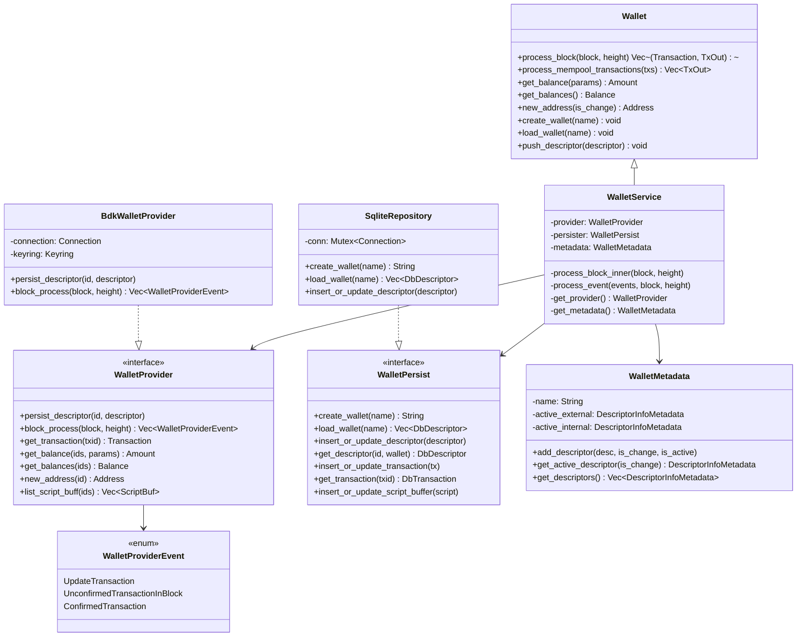
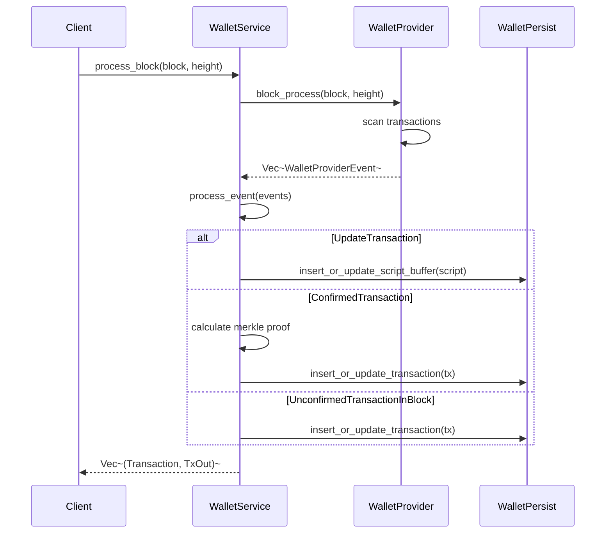

# Floresta Watch-Only Wallet

A lightweight, modular watch-only Bitcoin wallet library designed for Electrum protocol support and descriptor-based address management. This crate provides a layered architecture that separates concerns across transaction discovery, state persistence, and wallet orchestration.

## Overview

The watch-only wallet enables applications to:
- Monitor Bitcoin transactions for multiple descriptors
- Track address derivation and UTXO management
- Store wallet state and transaction history persistently
- Expose wallet state via standardized interfaces (Electrum protocol)
- Support multiple blockchain provider backends (BDK, future providers)

## Architecture

The wallet is organized into three primary layers:

```
┌─────────────────────────────────────────────────┐
│        Wallet Service (Orchestration)           │
│  - Wallet lifecycle management                  │
│  - Transaction event coordination               │
│  - Balance aggregation                          │
└──────────────┬──────────────────────────────────┘
               │
       ┌───────┴────────┬──────────────┐
       │                │              │
┌──────▼────────┐ ┌────▼──────┐ ┌────▼───────┐
│   Provider    │ │Repository │ │  Metadata  │
│ (Discovery)   │ │(Storage)  │ │(State)     │
└───────────────┘ └───────────┘ └────────────┘
```

### Layer Responsibilities

#### **Provider Layer** (`provider/`)
Handles transaction discovery and descriptor-specific data retrieval:
- Persists Bitcoin descriptors
- Deriving addresses from descriptors
- Detects incoming and outgoing transactions
- Tracks UTXOs per descriptor
- Calculates balances with confirmation requirements
- Processes blockchain events (blocks, mempool)

#### **Repository Layer** (`repository/`)
Manages persistent wallet state at the wallet level:
- Stores wallet names (**wallet lifecycle**)
- Persists descriptors with metadata (active flag, change flag, labels)
- Indexes transactions for Electrum responses
- Tracks script buffers for address monitoring
- Provides migration-based SQLite backend

#### **Service Layer** (`service/`)
Orchestrates operations across provider, repository, and metadata:
- Manages wallet creation and loading
- Coordinates descriptor lifecycle (add, activate, deactivate)
- Aggregates balance from all descriptors
- Routes blockchain events to appropriate handlers
- Provides unified wallet interface to clients

#### **Metadata Layer** (`metadata/`)
Maintains in-memory wallet configuration:
- Active descriptor management per category (external/change)
- Descriptor state administration
- Handles descriptor transitions when adding new descriptors
- Enforces business rules (e.g., single active descriptor)

## Component Architecture

### Class Diagram


```mermaid
classDiagram
    class Wallet{
        +process_block(block, height) Vec~(Transaction, TxOut)~
        +process_mempool_transactions(txs) Vec~TxOut~
        +get_balance(params) Amount
        +get_balances() Balance
        +new_address(is_change) Address
        +create_wallet(name) void
        +load_wallet(name) void
        +push_descriptor(descriptor) void
    }

    class WalletService{
        -provider: WalletProvider
        -persister: WalletPersist
        -metadata: WalletMetadata
        -process_block_inner(block, height)
        -process_event(events, block, height)
        -get_provider() WalletProvider
        -get_metadata() WalletMetadata
    }

    class WalletProvider{
        <<interface>>
        +persist_descriptor(id, descriptor)
        +block_process(block, height) Vec~WalletProviderEvent~
        +get_transaction(txid) Transaction
        +get_balance(ids, params) Amount
        +get_balances(ids) Balance
        +new_address(id) Address
        +list_script_buff(ids) Vec~ScriptBuf~
    }

    class WalletPersist{
        <<interface>>
        +create_wallet(name) String
        +load_wallet(name) Vec~DbDescriptor~
        +insert_or_update_descriptor(descriptor)
        +get_descriptor(id, wallet) DbDescriptor
        +insert_or_update_transaction(tx)
        +get_transaction(txid) DbTransaction
        +insert_or_update_script_buffer(script)
    }

    class WalletMetadata{
        -name: String
        -active_external: DescriptorInfoMetadata
        -active_internal: DescriptorInfoMetadata
        +add_descriptor(desc, is_change, is_active)
        +get_active_descriptor(is_change) DescriptorInfoMetadata
        +get_descriptors() Vec~DescriptorInfoMetadata~
    }

    class BdkWalletProvider{
        -connection: Connection
        -keyring: Keyring
        +persist_descriptor(id, descriptor)
        +block_process(block, height) Vec~WalletProviderEvent~
    }

    class SqliteRepository{
        -conn: Mutex~Connection~
        +create_wallet(name) String
        +load_wallet(name) Vec~DbDescriptor~
        +insert_or_update_descriptor(descriptor)
    }

    class WalletProviderEvent{
        <<enum>>
        UpdateTransaction
        UnconfirmedTransactionInBlock
        ConfirmedTransaction
    }

    Wallet <|-- WalletService
    WalletService --> WalletProvider
    WalletService --> WalletPersist
    WalletService --> WalletMetadata
    BdkWalletProvider ..|> WalletProvider
    SqliteRepository ..|> WalletPersist
    WalletProvider --> WalletProviderEvent
```

### Data Flow: Block Processing


```mermaid
sequenceDiagram
    participant Client
    participant Service as WalletService
    participant Provider as WalletProvider
    participant Repository as WalletPersist

    Client->>Service: process_block(block, height)
    Service->>Provider: block_process(block, height)
    Provider->>Provider: scan transactions
    Provider-->>Service: Vec~WalletProviderEvent~

    Service->>Service: process_event(events)

    alt UpdateTransaction
        Service->>Repository: insert_or_update_script_buffer(script)
    else ConfirmedTransaction
        Service->>Service: calculate merkle proof
        Service->>Repository: insert_or_update_transaction(tx)
    else UnconfirmedTransactionInBlock
        Service->>Repository: insert_or_update_transaction(tx)
    end

    Service-->>Client: Vec~(Transaction, TxOut)~
```

## Usage Examples

### Creating a Watch-Only Wallet

```rust no-run
use floresta_watch_only::service::new_wallet;
use bitcoin::Network;

// Create a new wallet instance
let wallet = new_wallet("./wallet_data", Network::Bitcoin)?;

// Create a wallet with a name
wallet.create_wallet("my_wallet")?;
```

### Adding Descriptors

```rust no-run
use floresta_watch_only::models::ImportDescriptor;

let descriptor = ImportDescriptor {
    descriptor: "wpkh(tpubDDtyive2LqLWKzPZ8LZ9Ebi1JDoLcf1cEpn3Mshp6sxVfCupHZJRPQTozp2EpTF76vJcyQBN7VP7CjUntEJxeADnuTMNTYKoSWNae8soVyv/0/*)#7h6kdtnk".to_string(),
    label: Some("receiving".to_string()),
    is_active: true,
    is_change: false,
};

wallet.push_descriptor(&descriptor)?;
```

### Processing Blocks

```rust no-run
use bitcoin::Block;

// Process a new block and get affected transactions
let transactions = wallet.process_block(&block, block_height)?;

for (tx, output) in transactions {
    println!("Received: {} satoshis", output.value.to_sat());
}
```

### Querying Balances

```rust no-run
use floresta_watch_only::models::GetBalanceParams;

// Get balance with 1 confirmation minimum
let balance = wallet.get_balance(GetBalanceParams {
    minconf: 1,
    avoid_reuse: false,
})?;

println!("Balance: {} BTC", balance.to_btc());

// Get detailed balance breakdowns
let balances = wallet.get_balances()?;
println!("Trusted: {}", balances.trusted.to_btc());
println!("Unconfirmed: {}", balances.untrusted_pending.to_btc());
println!("Immature: {}", balances.immature.to_btc());
```

### Generating Addresses

```rust no-run
// Generate external address
let address = wallet.new_address(false)?;
println!("Receive at: {}", address);

// Generate change address
let change_address = wallet.new_address(true)?;
println!("Change at: {}", change_address);
```

### Transaction Queries

```rust no-run
use bitcoin::Txid;

// Get a specific transaction
let tx = wallet.get_transaction(&txid)?;

// Get transaction history for an address
let history = wallet.get_address_history(&script_hash)?;

// Get merkle proof for confirmed transaction
let proof = wallet.get_merkle_proof(&txid)?;

// Find all unconfirmed transactions
let unconfirmed = wallet.find_unconfirmed()?;
```

## Feature Flags

The crate uses feature flags to enable different implementations:

### `bdk-provider`
Enables the BDK-based wallet provider for transaction discovery.
- Requires: `bdk-wallet` dependency
- Provides: Descriptor-based address derivation and transaction scanning

### `sqlite`
Enables SQLite-backed persistence layer for wallet state.
- Requires: `rusqlite`, `refinery` dependencies
- Provides: Durable wallet, descriptor, and transaction storage

### Recommended Combinations

- **Full Watch-Only Wallet**: `bdk-provider` + `sqlite`
- **Development/Testing**: `memory-database` (in-memory storage)

```toml
# In your Cargo.toml
[dependencies]
floresta-watch-only = { version = "0.4", features = ["bdk-provider", "sqlite"] }
```

## Error Handling

The crate provides specific error types for each layer:

- **`WalletProviderError`**: Transaction discovery and descriptor issues
- **`WalletPersistError`**: Storage and database operations
- **`WalletServiceError`**: High-level wallet operations
- **`WalletMetadataError`**: Descriptor state management

## Concurrency Model

The wallet uses `RwLock` for thread-safe metadata access:
- Multiple readers can query wallet state concurrently
- Writes (adding descriptors, processing blocks) acquire exclusive locks
- Repository operations use internal `Mutex` for SQLite compatibility

## Development

### Running Tests

```bash
# Unit tests
cargo test --lib

# Provider tests (requires bdk-provider feature)
cargo test --test provider --features bdk-provider,sqlite

# Service tests (requires both features)
cargo test --test service --features bdk-provider,sqlite

# All tests
cargo test --features bdk-provider,sqlite
```

### Building Documentation

```bash
cargo doc --features bdk-provider,sqlite --open
```

## License

Licensed under either of Apache License, Version 2.0 or MIT license at your option.
